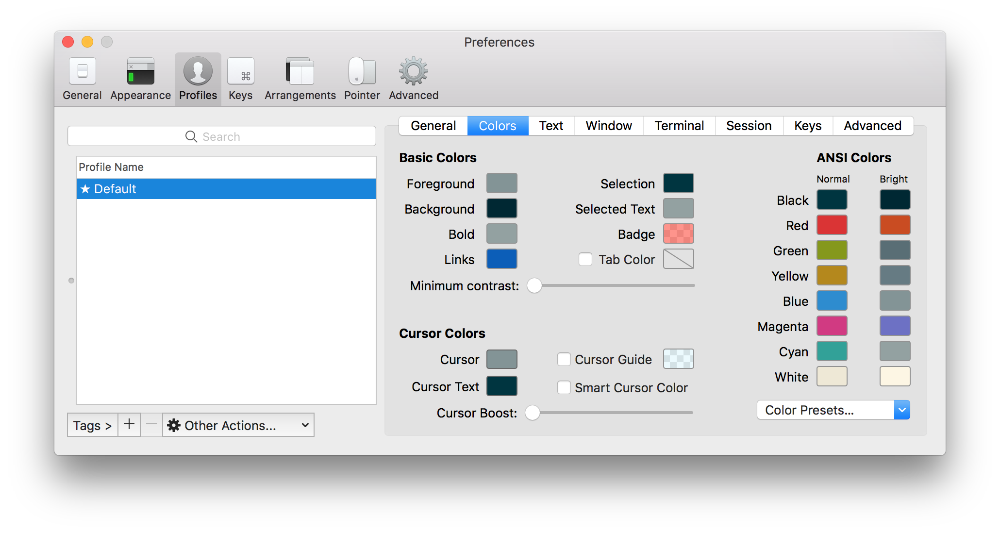
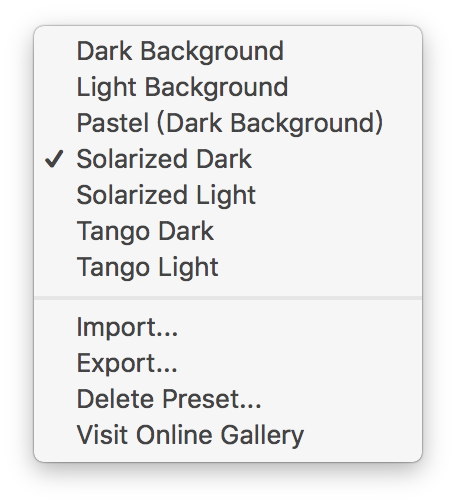

`zsh-syntax-highlighting`




```
shell> sh -c "$(curl -fsSL https://raw.githubusercontent.com/robbyrussell/oh-my-zsh/master/tools/install.sh)"
shell> sh -c "$(wget https://raw.githubusercontent.com/robbyrussell/oh-my-zsh/master/tools/install.sh -O -)"
```

`.zshrc`

```
plugins=(git bundler osx rake ruby)
ZSH_THEME="robbyrussell"
ZSH_THEME="agnoster"

fpath=(/usr/local/share/zsh-completions $fpath)
source /usr/local/share/zsh-syntax-highlighting/zsh-syntax-highlighting.zsh
```

```
shell> git clone https://github.com/powerline/fonts.git

shell> cd fonts
shell> ./install.sh

shell> cd ..
shell> rm -rf fonts
```
```
shell> git clone git://github.com/altercation/solarized.git
shell> mkdir -p ~/.vim/colors/
shell> cd solarized
shell> cd vim-colors-solarized/colors
shell> cp solarized.vim ~/.vim/colors/
shell> cd ../../..
shell> rm -rf solarized
```

`~/.vimrc`
```
syntax enable
set background=dark
colorscheme solarized
```
```
syntax enable
set background=light
colorscheme solarized
```

#### :books: 參考網站：
- [iterm2](https://www.iterm2.com/)
- https://github.com/powerline/fonts
- https://github.com/altercation/vim-colors-solarized
